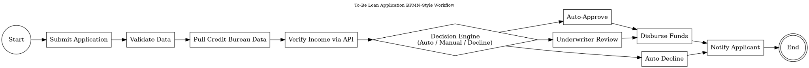
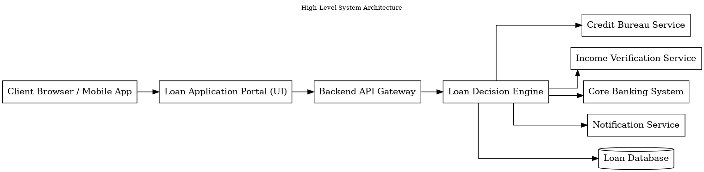
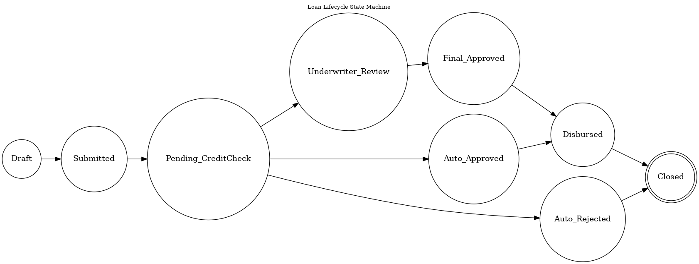
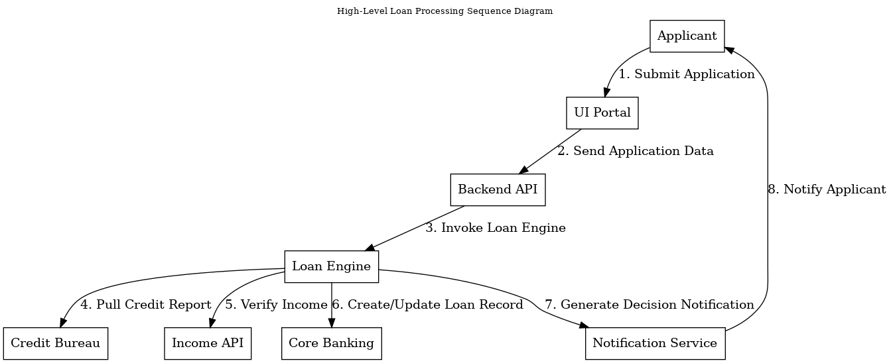

# Business Requirements

This document outlines the high-level business needs for the Automated Loan Decisioning System (ALDS). The purpose of these requirements is to define what the business expects the solution to achieve, ensuring alignment with regulatory standards, customer expectations, and operational efficiency goals.

---

## 1. Business Context

ABCD Bank aims to modernize its personal lending process, moving away from manual reviews and reducing customer wait times. Competitors have introduced near-instant approval systems, and customer expectations have shifted toward faster, more transparent digital borrowing experiences. ALDS supports this shift by automating verification steps, centralizing decision logic, and improving the consistency of underwriting outcomes.

---

## 2. Business Objectives

- Reduce loan decision times from 5–7 days to under 1 hour for standard applications.  
- Improve applicant experience through automation and real-time status updates.  
- Strengthen adherence to OSFI B-20, AML, and internal compliance guidelines.  
- Decrease operational load on underwriting teams by automating predictable cases.  
- Improve auditability and transparency through standardized decision logs.  
- Build a modern rules-driven architecture that supports future lending products.

---

## 3. Scope Overview

### In Scope
- Online loan application intake  
- Automated income verification through third-party APIs  
- Real-time credit bureau integration  
- Rules engine for risk scoring and decisioning  
- Routing for medium-risk and flagged cases  
- Automated approval/decline communications  
- Applicant status tracking and notifications  
- Audit logging for all decisions and rule executions  

### Out of Scope
- Branch-based application workflows  
- Mortgage products or commercial lending  
- Collections or post-funding workflows  
- Mobile app redesign  

---

## 4. High-Level Business Processes

The future-state workflow is represented in the BPMN diagram:

---

## 5. Functional Business Requirements (Summary)

- Retrieve credit reports from approved credit bureaus.  
- Calculate DTI using applicant debts and verified income.  
- Assign risk categories (Low, Medium, High).  
- Auto-approve eligible low-risk applications.  
- Route medium-risk cases to manual underwriting.  
- Auto-decline ineligible applications.  
- Verify identity via KYC provider.  
- Provide real-time application status.  
- Generate standardized decision letters.  
- Log all decisions and rule executions.

Details are elaborated in the BRD and FSD.

---

## 6. Non-Functional Considerations (Alignment Only)

Key expectations include:

- High availability and predictable performance.  
- Regulatory compliance for lending and privacy.  
- Secure handling of sensitive data.  
- Audit-ready logging and reporting.

---

## 7. Related Diagrams

Architecture Overview:  

Loan State Machine:  

Sequence Overview:  

---

## 8. Approval

This document forms the foundation for the BRD and is intended for review and sign-off by business owners, risk and compliance, underwriting leadership, and technology stakeholders.
