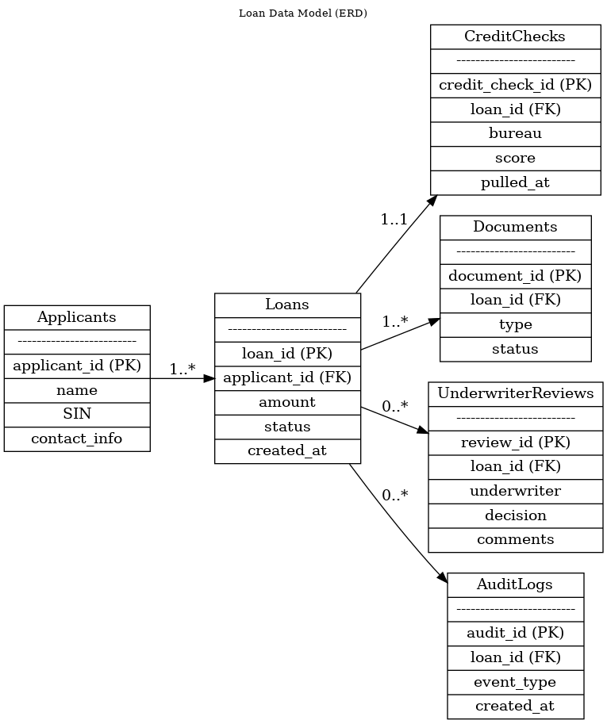

# Functional Specification Document (FSD)

This Functional Specification Document describes how the Automated Loan Decisioning System (ALDS) will operate, including components, integrations, and key behaviors.

---

## 1. System Overview

ALDS automates key steps in loan assessment: income verification, credit retrieval, risk scoring, decisioning, routing, and communication. It integrates with external providers and internal banking systems while centralizing business rules.

---

## 2. Architecture

Core components:

- Customer application portal  
- API gateway  
- Income and identity verification services  
- Credit bureau integration layer  
- Rules engine  
- Underwriting dashboard  
- Core banking integration  
- Audit log store

---

## 3. Functional Areas

- **Application Intake:** Gather and validate applicant data.  
- **Income Verification:** Call external APIs, reconcile declared vs. verified amounts, raise flags.  
- **Credit Bureau Retrieval:** Fetch scores and reports, handle retries, and errors.  
- **Risk Assessment:** Calculate DTI, assign risk tiers, evaluate eligibility.  
- **Decisioning:** Auto-approve, auto-decline, or route for manual review.  
- **Notifications:** Update applicants in real time and trigger document generation.  
- **Underwriter Review:** Provide dashboards and tools for manual case handling.

---

## 4. Sequence Flow

The sequence diagram illustrates how the portal, backend services, rules engine, and external providers interact during loan processing.

---

## 5. Data Model

Key entities:

- Applicants  
- Loans  
- CreditChecks  
- IncomeVerifications  
- UnderwriterReviews  
- AuditLogs  

---

## 6. Loan States

Primary states include:

- Draft  
- Submitted  
- Pending Verification  
- Auto-Approved  
- Auto-Declined  
- Manual Review  
- Final Approved  
- Disbursed  
- Closed  

---

## 7. Error Handling

- API retry and backoff for external providers.  
- Clear user-facing error messages for recoverable issues.  
- Exception queue for unresolved technical or data issues.

---

## 8. Logging & Audit

The system logs:

- Inputs to the rules engine  
- Rules fired and outcomes  
- Final decisions and manual overrides  
- Template versions used for documentation  

All logs must be queryable for compliance audits.

---

## 9. Dependencies

- External credit and income providers  
- Internal identity verification and core banking systems  
- Monitoring and alerting infrastructure
